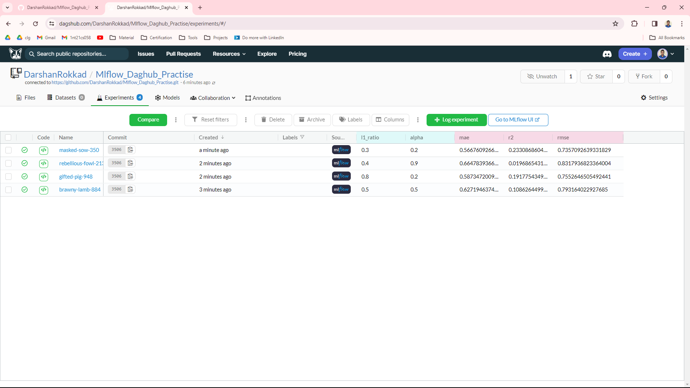

<h1 align="center">Mlflow Dagshub Practise</h1>

<h3 align="center">Write "mlflow ui" to see the dashboard in the local machine.</h3>  

  

  

  

  

---

<h3 align="center">By using dagshub as a remote repository.</h3>  

Connect the github reposiory to dagshub and then copy the below commands.
  

  

Export the copied commands in the git bash.Then you have to set the dagshub remote repository url in the mlflow code.
  

Then run the app.py and give different parameter and in dags hub you can track them.
  

  

Can use mlflow ui in dagshub.
  

  

  

Can label model after experiment like staging or production based on what we do so later it will be easy to track.
  

  

  

---
